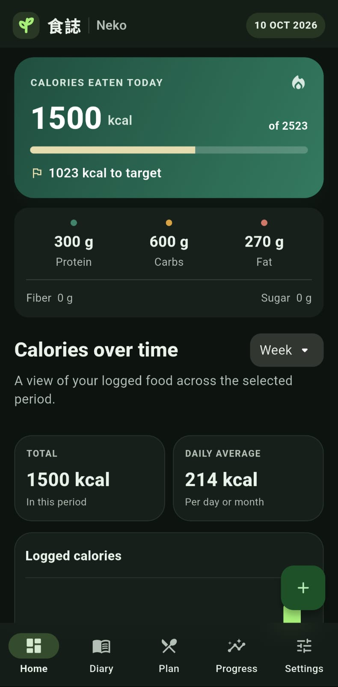
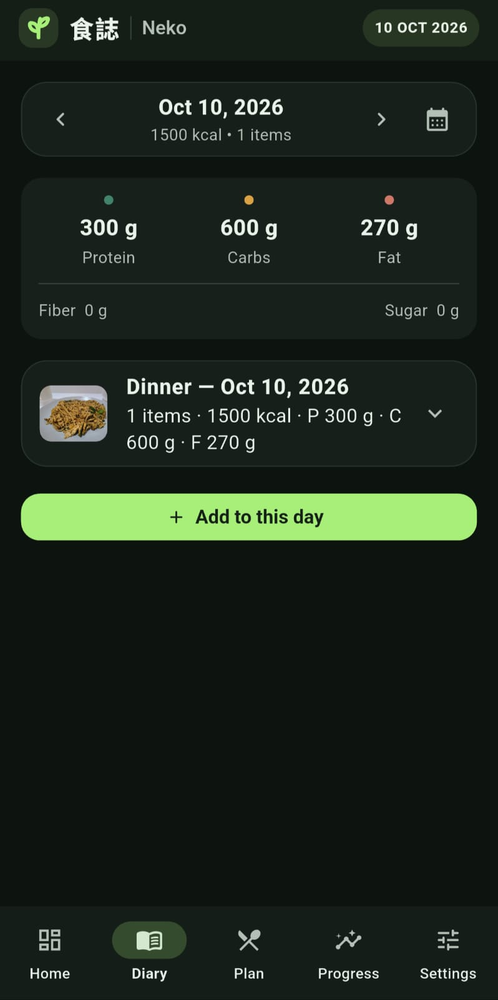
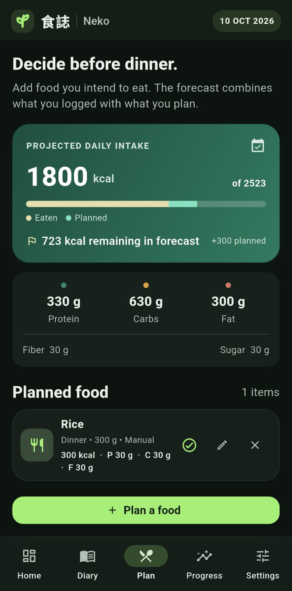
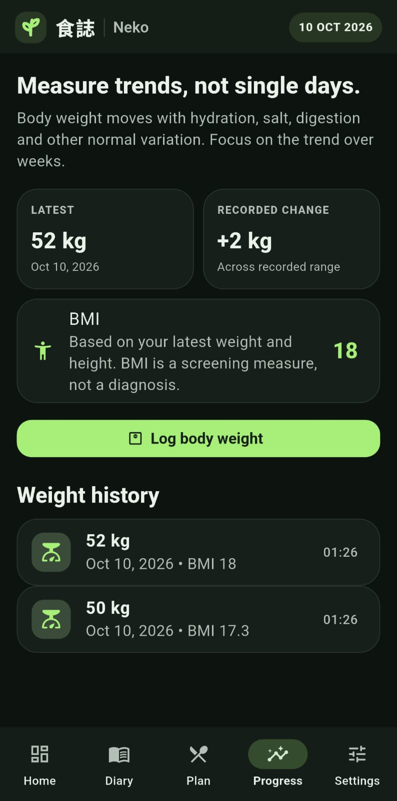
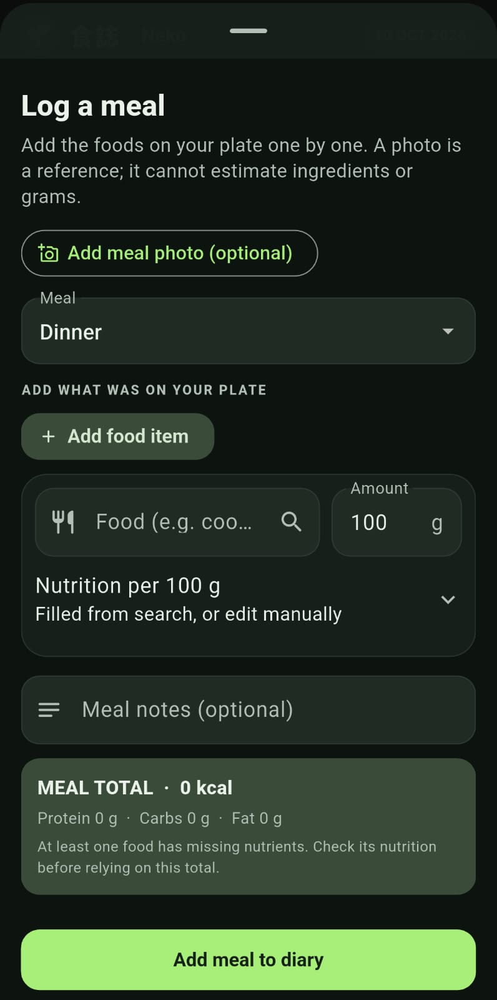
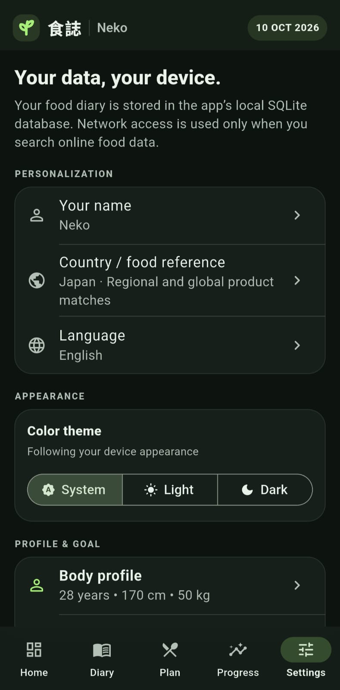

<<<<<<< HEAD
# Nutri Diary — Flutter starter

An early **local-first** personal food diary for Android and iOS. Food logs, weight measurements, profile and goals are stored locally in SQLite. The app has optional user-initiated online searches for food composition data; it does not currently send diary records or food photos to a server.

> **Honesty about the photo feature:** this starter lets you attach a photo to an entry, but it does not yet recognize food or infer portion size from that photo. A photo by itself is not sufficient to calculate accurate calories for many meals. See `docs/PRODUCT_REVIEW.md` for the proposed recognition flow.

## What's included

- Five tab areas: Today, Food diary, Meal planner, Progress and Settings.
- Per-100 g nutrition scaling for calories, protein, carbohydrates, fat, fibre and sugar.
- Planned food is stored separately from eaten food, so the forecast can be compared with the daily target.
- Weight-goal estimates using Mifflin–St Jeor BMR, an activity multiplier and conservative deadline guardrails.
- Open Food Facts food search; optional USDA FoodData Central search using a developer-supplied API key.
- Food photos copied into app documents storage, not merely retained at their temporary picker path.
- Passphrase-encrypted backup and restore. Backups include the profile, entries, weight logs and photo bytes; legacy JSON backups can still be imported.
- A few unit tests for portion scaling and goal plausibility.

## Run it

You need a recent Flutter SDK with Dart 3.7 or later. Flutter is not vendored in this archive.

1. Extract this folder.
2. From this folder, generate the native Android and iOS runner folders:

   ```bash
   flutter create --project-name nutri_diary --platforms=android,ios .
   ```

   If your Flutter version overwrites `pubspec.yaml`, restore this archive's `pubspec.yaml` before continuing.

3. Install dependencies and run tests:

   ```bash
   flutter pub get
   flutter test
   flutter analyze
   flutter run
   ```

   To run the web version, use `flutter run -d edge` (or another browser device). Web data is stored in that browser's IndexedDB and is scoped to the site's origin, including its port. The SQLite WebAssembly and worker files in `web/` are required for web builds.

4. If you want USDA search, create a personal API key at [FoodData Central](https://fdc.nal.usda.gov/api-key-signup.html) and run:

   ```bash
   flutter run --dart-define=USDA_API_KEY=YOUR_KEY
   ```

   This key is compiled into the app and can be extracted from a client build. This is acceptable only as a personal-development convenience, not a production secret-management strategy. USDA's documentation explicitly warns against publishing keys. Without this key, Open Food Facts search still works when online and manually entered food is always available.

## Platform setup notes

- Make sure the Android app manifest contains `android.permission.INTERNET` for online search.
- For iOS, add user-facing `NSCameraUsageDescription` and `NSPhotoLibraryUsageDescription` strings to `ios/Runner/Info.plist` for the photo feature. Test camera and photo picking on real devices.
- Do not assume Android backup automatically includes this app's SQLite database and photo directory in a portable way. Use the in-app export and keep a backup outside the device.
- Online lookup requests send the search term to Open Food Facts and, when configured, USDA. The app does not currently upload food photos for recognition.

## Current limitations

- This is a **starter**, not a medically validated nutrition product.
- The food database is not exhaustive. Search results may omit regional foods, recipes and poorly documented products.
- Search data can be incomplete or have the wrong preparation state (e.g., raw vs cooked). Verify the selected item and enter the actual consumed grams.
- Attaching a photo is only record-keeping; AI food detection and image-based gram estimation are not implemented.
- Goal calculations use a simplified static calorie model. Actual weight response adapts over time, and calories estimated by formulas are not precise measurements.
- Protein and muscle gain recommendations have not been individualized for medical history, kidney disease, pregnancy, medications, age under 18 or eating-disorder risk.
- Encrypted exports embed images; large photo histories can produce large backup files. The local SQLite database is in app-private storage but is not separately encrypted in this starter. Web storage uses browser IndexedDB.
- Country preference currently chooses a regional Open Food Facts site. Official country composition databases are not yet integrated, and app text is not fully translated; the language preference localizes Flutter's built-in controls.

## Project map

```text
lib/
  main.dart                      App shell and navigation
  models/nutrition.dart           Food entries, nutrition values, profile and goal models
  data/app_database.dart          Local SQLite storage and replacement import
  services/food_search_service.dart  Open Food Facts + optional USDA search
  services/nutrition_calculator.dart BMR, TDEE, food totals and goal guardrails
  services/backup_service.dart    JSON import/export with embedded photos
  ui/screens.dart                 Five app areas and entry/profile forms
test/
  nutrition_calculator_test.dart
```

## Food-data attribution / licensing

- USDA FoodData Central data is public domain under CC0 1.0; USDA requests source attribution. The API requires a key and has rate limits. Read [the USDA API guide](https://fdc.nal.usda.gov/api-guide/) before shipping an app that uses it.
- Open Food Facts has database and content licensing obligations, including ODbL share-alike provisions for the database and separate image licensing. Review [the Open Food Facts licensing guide](https://openfoodfacts.github.io/openfoodfacts-server/api/tutorials/license-be-on-the-legal-side/) before distributing an app or a derivative database.
- This app does not bundle or redistribute an entire third-party database.

## Next engineering milestones

1. Run the scaffold on both Android and iOS; fix platform-specific issues and test backup round-trips.
2. Add a persistent, searchable local food catalogue and favourites/recent foods.
3. Add recipe builder (ingredient quantities, cooked/raw states, cooked yield, per-serving nutrition) and barcode scanning.
4. Add weekly trends and separate calorie/protein targets with transparent provenance/confidence.
5. Add opt-in on-device image classification, then image-assisted ingredient suggestions and a user-confirmed portion step.
6. Only then consider an optional AI assistant. Keep remote inference off by default if strict local-only privacy is a requirement.
=======
# 食誌 ShyokuShi 🍃

### A quiet space for your daily food journal.

<p align="center">
  
</p>

<p align="center">
  <strong>Eat mindfully. Track honestly. Keep your data yours.</strong>
</p>

<p align="center">
  
  
  
  
  
</p>

---

## 🌿 About

**食誌 (ShyokuShi)** is a personal food diary and nutrition tracker built with Flutter and Dart.

Record what you eat, explore nutritional estimates, plan upcoming meals, and track your weight history—all in one calm, personal space.

ShyokuShi is designed around a simple idea: understanding your eating habits should be useful, approachable, and respectful of your privacy.

## ✨ Features

### 🏠 Daily dashboard
- View calories consumed against your estimated daily target.
- Track protein, carbohydrates, and fat.
- Explore calorie history by week, month, quarter, or year.
- Review period totals and daily averages.

### 🍱 Food diary
- Record multiple foods in each meal.
- Enter quantities in grams and nutritional values.
- Add optional meal photos and notes.
- Browse previous days and review your meals.
- Edit or delete diary entries.

### 🔎 Food search
- Search supported food databases.
- Review available nutrition information.
- Enter food and nutrient values manually when needed.
- Choose a regional food-reference preference for Japan, the United States, Canada, the United Kingdom, South Korea, China, or Other.

**Supported food-data providers:**
- [Open Food Facts](https://world.openfoodfacts.org/)
- [USDA FoodData Central](https://fdc.nal.usda.gov/)

Food records can be incomplete or inaccurate. Check packaging and product information when possible.

### 📅 Meal planner
- Plan foods before recording them as eaten.
- Preview projected daily calorie intake.
- Combine logged and planned food in your forecast.
- Mark planned entries as eaten when appropriate.

### 📈 Weight and progress tracking
- Record body-weight measurements.
- Review historical changes.
- View progress over your recorded date range.
- Calculate BMI when sufficient profile information is available.

### 🎯 Personal goals
- Configure your profile and activity level.
- Choose weight loss, weight gain, or maintenance goals.
- Review estimated daily calorie needs.
- Set a target weight and date.
- Receive warnings about targets that may be unrealistic.

Calorie and weight projections are estimates, not medical advice.

### 🎨 Personalization
- English, Japanese, Chinese, and Korean interface options.
- Light, dark, and system appearance modes.
- Custom display name.
- A clean interface featuring the 食誌 branding.

### 🔐 Encrypted backups
- Export your records to an encrypted backup.
- Restore supported encrypted backups using the generated key.
- Import supported legacy JSON backups.
- Preserve available diary, profile, preference, weight-history, and meal-photo data in supported exports.

**Important:** Keep your backup key safe. Importing a backup replaces existing records, so export your current data first.

---

## 📱 Screenshots

Take a look inside ShyokuShi.

<p align="center">
  
  &nbsp;&nbsp;
  
  &nbsp;&nbsp;
  
</p>

<p align="center">
  
  &nbsp;&nbsp;
  
  &nbsp;&nbsp;
  
</p>

---

## 🔒 Privacy first

ShyokuShi follows a **local-first approach** to personal food journaling.

| Privacy feature | Current behavior |
|---|---|
| Account required | No |
| Diary and profile storage | Local on your device |
| Food photos | Stored locally |
| Cloud diary synchronization | Not implemented |
| Advertising and analytics | None in this version |
| Online food search | Queries are sent to the selected food-data provider |
| AI food-photo recognition | Not implemented |
| Live database encryption | Not separately encrypted |
| Exported backups | Encrypted; require the generated key to restore |

### 🛡️ What this means

- Your diary, profile, and photos are not sent as part of food-search requests.
- Food searches require an internet connection and transmit search terms to the relevant external provider.
- The live application database is **not separately encrypted**. Protect your device and keep exported backups secure.
- Backup encryption protects the exported copy; it does not encrypt the live database.

For more details, consult the privacy notice and terms available in the application.

---

## 🛠️ Built with

- **[Flutter](https://flutter.dev/)** — cross-platform application framework.
- **[Dart](https://dart.dev/)** — application programming language.
- **[Open Food Facts](https://world.openfoodfacts.org/)** — packaged-food information.
- **[USDA FoodData Central](https://fdc.nal.usda.gov/)** — food composition data.

Food-data providers are independent services and do not endorse ShyokuShi. Their data may vary in coverage, completeness, and accuracy. Review their applicable terms and attribution requirements when distributing the application.

---

## 🚀 Getting started

### Prerequisites

Make sure you have installed:

- [Flutter SDK](https://docs.flutter.dev/get-started/install)
- Dart SDK compatible with your Flutter version
- Android SDK and build tools
- Android device or emulator
- Git

Internet access is needed for online food searches.

### 1. Clone the repository

Replace `YOUR_USERNAME` with your GitHub username.

```bash
git clone https://github.com/YOUR_USERNAME/shiyokushi.git
cd shiyokushi
```

### 2. Install dependencies

```bash
flutter pub get
```

### 3. Check your development environment

```bash
flutter doctor
```

### 4. Run the application

Connect an Android device or start an emulator.

```bash
flutter devices
flutter run
```

### 📦 Build a release APK

```bash
flutter build apk --release
```

The generated APK is normally located at:

```text
build/app/outputs/flutter-apk/app-release.apk
```

To install the release build on a connected device, use:

```bash
flutter install
```

Android may require permission to install APKs from your chosen source.

### 🍎 iOS status

The project uses Flutter, but building and validating an iOS release requires macOS and Apple's development toolchain. iOS compatibility should not be assumed until the application and its plugins have been tested on that platform.

---

## ⚠️ Current limitations

- Food searches require internet access.
- Food database results may not exactly match the food or preparation method consumed.
- Nutrition values depend on the information available or entered.
- Country preferences do not guarantee official national nutrition data.
- Food photos are not analyzed by an AI model.
- The application does not automatically estimate food portions from photographs.
- The live local database is not separately encrypted.
- Lost backup keys cannot be recovered by the application.
- Importing a backup replaces existing records.
- Calorie needs, BMI, and weight projections are estimates, not medical assessments.
- iOS requires a separate build and validation process.

---

## 🩺 Responsible use

ShyokuShi is a personal tracking and wellness tool. It does not diagnose, prevent, or treat medical conditions and is not a substitute for professional healthcare or individualized nutrition advice.

Nutrition estimates and progress charts should be interpreted with care. Consult a qualified healthcare professional for medical concerns or personalized dietary guidance.

---

## 🤝 Contributing

ShyokuShi is currently a personal project. Contributions and constructive feedback are welcome if the repository is open to community participation.

Before submitting a substantial change, consider opening an issue to discuss the proposed improvement.

Please help maintain the project's quality and privacy principles:

- 🧪 Add tests for nutrition calculations and backup behavior.
- 🔐 Never commit passwords, API secrets, signing keys, or personal backups.
- 🧹 Keep personal health records out of screenshots, test fixtures, and commits.
- 📝 Document new external data transmissions.
- 🌱 Preserve the local-first approach unless a change is explicitly documented.
- 📚 Respect third-party data terms and licenses.

---

## 📄 License

ShyokuShi is licensed under the **MIT License**. See the [`LICENSE`](LICENSE) file for the complete license text.

The MIT License permits use, copying, modification, merging, publishing, distribution, sublicensing, and sale of copies of the software, subject to its conditions, including preservation of the copyright and permission notice.

The software is provided **"as is"**, without warranty, as described in the license.

The MIT license for this repository does not automatically grant rights to third-party trademarks, data, or assets that may have separate license terms.

---

## 🍃 A note from the developer

ShyokuShi was built around a simple belief: tracking what you eat should help you understand your habits, not make food feel like a competition.

It is a personal journal for noticing patterns, learning over time, and making informed choices at your own pace.

**食誌 — your food, your record, your pace.** 🌿
>>>>>>> 2af91bc042fdda97eab657e653ea6322490ab5fc
